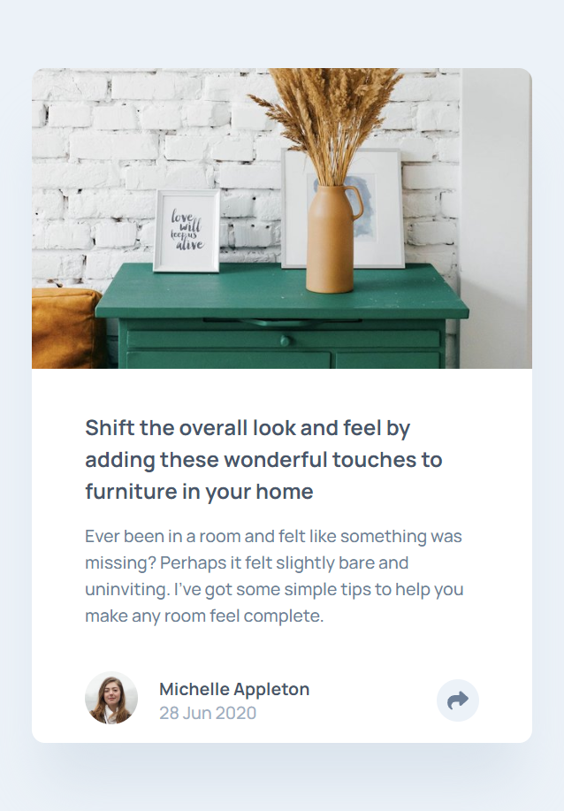
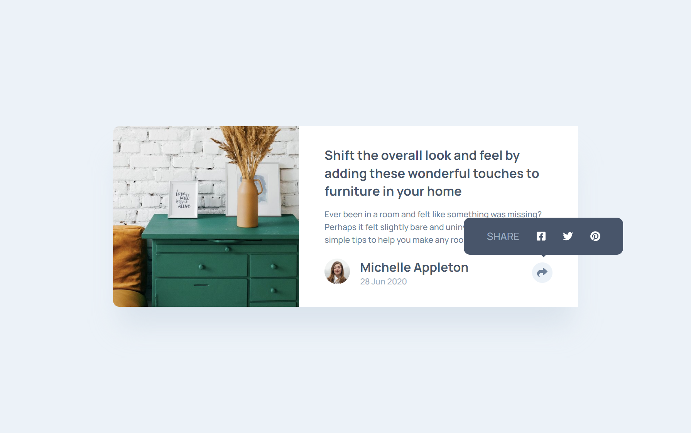

# Frontend Mentor - Article preview component solution

This is a solution to the [Article preview component challenge on Frontend Mentor](https://www.frontendmentor.io/challenges/article-preview-component-dYBN_pYFT). Frontend Mentor challenges help you improve your coding skills by building realistic projects.

## Table of contents

-   [Overview](#overview)
    -   [The challenge](#the-challenge)
    -   [Screenshot](#screenshot)
    -   [Links](#links)
-   [My process](#my-process)
    -   [Built with](#built-with)
    -   [What I learned](#what-i-learned)
    -   [Useful resources](#useful-resources)
-   [Author](#author)
-   [Acknowledgments](#acknowledgments)

## Overview

### The challenge

Users should be able to:

-   View the optimal layout for the component depending on their device's screen size
-   See the social media share links when they click the share icon

### Screenshot

### Links

-   Solution URL: [https://github.com/NataJenkins/article-preview-component](https://github.com/NataJenkins/article-preview-component)
-   Live Site URL: [https://eloquent-sable-5fc87a.netlify.app](https://eloquent-sable-5fc87a.netlify.app)

## My process

### Built with

-   Semantic HTML5 markup
-   CSS custom properties
-   Flexbox
-   CSS Grid
-   Mobile-first workflow
-   [React](https://reactjs.org/) - JS library
-   [Styled Components](https://styled-components.com/) - For styles

### What I learned

In this project i created a custom hook function using UseRef to detect when clickin outside a component.

### Useful resources

-   [React Hook: Detect Click outside of Component](https://www.robinwieruch.de/react-hook-detect-click-outside-component/) - This helped me creating the hook for detecting outside component clicking.

## Author

-   Website - [Add your name here](https://www.your-site.com)
-   Frontend Mentor - [@yourusername](https://www.frontendmentor.io/profile/yourusername)
-   Twitter - [@yourusername](https://www.twitter.com/yourusername)
